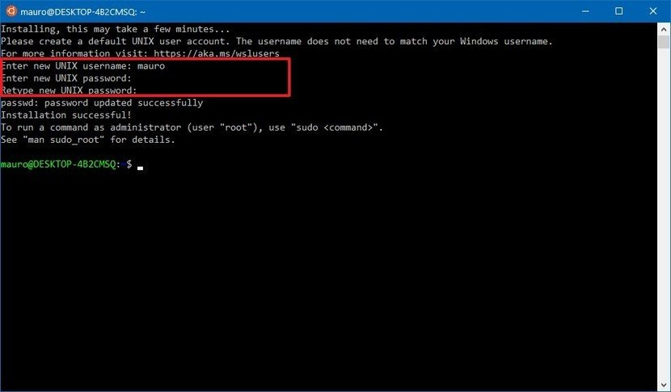

# Windows Subsystem Linux Setup
  - [Getting Started](#getting-started)
    - [Prerequisites](#prerequisites)
    - [Installing Windows Subsystem Linux Setup](#installing-windows-subsystem-linux-setup)
    - [How to Use Linux from your Command Prompt](#how-to-use-linux-from-your-command-prompt)
    - [Installing Visual Studio Code on Linux](#installing-visual-studio-code-on-linux)
    - [How to Use Visual Studio Code](#how-to-use-visual-studio-code)
    - [Installing Python on Linux](#installing-python-on-linux)
    - [Installing Git on Linux](#installing-git-on-linux)


## Getting Started

These instructions will get you starte{d with setting up a linux subsytem as well as installing python and visual studio code.
I will be using C:\ to represent commands in the command prompt and $ to represent commands in the ubuntu shell. Do not copy
the C:\ and $ into your terminal.

### Prerequisites

Windows Machine with Windows 10 and Admin Access


### Installing Windows Subsystem Linux Setup

1. Open Settings
2. Click on Apps
3. Under the "Related settings" section, click the Programs and Features option


4. Click the Turn Windows features on or off


5. Check the Windows Subsystem for Linux option


6. Click the OK button
7. Restart your windows machine

After restart
1. Open Microsoft Store
2. Search for Ubuntu 18.04
3. Click the install button


4. Click the launch button
5. Create a username (I usually do first name)
6. Set a password (make sure you remember you will need it for any adminstrator operations) 



### How to Use Linux from your Command Prompt

1. Open up command prompt
2. Type in bash and hit enter
3. This should load your Ubuntu shell
4. To logout of the linux shell and go back to windows use ctrl + d

### Installing Visual Studio Code on Linux

I highly recommend using Visual Studio Code for development on a windows machine. 
It interacts well with linux and there are a lot of extensions to make development easier!

1. Install Windows 10 Visual Studio Code here [Windows 10 Download](https://code.visualstudio.com/download)
2. Open Visual Studio Code and install Remote - WSL
3. Make sure to reload Visual Studio Code after it finishes installing


### How to Use Visual Studio Code

1. Type cmd in your windows search bar and go to the directory with your programming folders
```
C:\ bash
```
2. Type bash and enter. The terminal should change and become username@computer-name:(directory)
3. If you want to open visual studio code in your current directory type code .
4. If you want to open visual studio code in a sub directory type code (directory name)
5. ctrl + ` will open up a bash terminal wherever you typed code from and from here you can do all the linux commands you learned in 216


### Installing Python on Linux

### Installing Git on Linux

1. Open up Ubuntu by either searching for Ubuntu or open up cmd and type in bash to load up Ubuntu
```
$ sudo apt-get update 
$ sudo apt install git-all
```
3. Follow [Git Started](https://github.com/ktpumd/git-started) Tutorial from KTP

